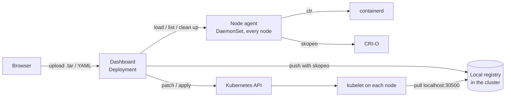

# Kubernetes Image Loader

**A web dashboard for air-gapped Kubernetes clusters.** Upload your application images as `.tar` files, keep them in a local registry inside the cluster, and deploy any version to any workload with a click. No internet or external registry needed.

Works with **CRI-O** and **containerd** (including k3s and RKE2). It picks up whichever runtime your kubelet uses on each node.


## What it does

- **Deploy from tar files.** Upload an image tar (`docker save`, `skopeo copy`, `ctr export`) and roll it out to a Deployment. The rollout is followed live, and one click rolls back.
- **Local image registry.** A registry runs inside the cluster, so every node, including new ones, can pull your images. Browse repositories and tags, see which workloads use each tag, and switch the registry on or off.
- **Images on nodes.** See every image CRI-O or containerd holds on each node, plus Docker's images where Docker is installed. **Clean up** dangling and unused images safely: nothing any pod or workload uses is ever removed.
- **Apply YAML.** Upload or paste manifests like `kubectl apply`, with a server-side dry run first. For each container, keep its image, pick one from the registry, or upload a tar.
- **Manage workloads.** Scale, restart, **autoscale (HPA)**, attach storage (claims, local disks, node directories), load environment from config maps and secrets, edit as YAML, delete.
- **Config maps, secrets and storage.** Create and edit them, see who uses what, create persistent volumes and claims, including local disks on a node.
- **Users and access.** Give each person their own token, a **role** (viewer, deployer, editor, admin) and a **scope** (some namespaces, or the whole cluster). Every change is recorded with who made it.

## How it works



- The **dashboard** is a small web app (FastAPI and plain JavaScript) that talks to the Kubernetes API.
- The **node agent** runs on every node. It imports images with `ctr` on containerd nodes and `skopeo` on CRI-O nodes, and lists images with `crictl`, exactly as the kubelet sees them.
- The **registry** is the CNCF Distribution registry, reachable by every node at `localhost:30500`.

See [docs/architecture.md](docs/architecture.md) for details.

## Quick start

You need a Kubernetes cluster (1.24 or newer), `kubectl` with admin rights, and **one machine with internet access** that has `skopeo` plus `docker` or `buildah`. The cluster itself can be fully offline.

```bash
# 1. On the internet machine: build the bundle (registry + dashboard + agent images)
git clone https://github.com/Sonupalsingh/k8s-image-loader-gui.git && cd k8s-image-loader-gui
make bundle                                  # creates k8s-image-loader-bundle-1.6.0.tar

# 2. On EVERY node: import it (uses ctr on containerd, skopeo on CRI-O)
tar -xf k8s-image-loader-bundle-1.6.0.tar && cd k8s-image-loader-bundle-1.6.0
sudo ./node-import.sh . localhost:30500

# 3. Where kubectl works: install the registry, then the dashboard
make registry
make deploy
make token                                   # prints your admin login token

# 4. Open the dashboard
kubectl -n k8s-image-loader patch svc image-loader-dashboard \
  -p '{"spec":{"type":"NodePort","ports":[{"port":80,"targetPort":"http","nodePort":30080}]}}'
# then browse to http://<any-node-ip>:30080
```

The full walkthrough, with expected output, runtime-specific steps and storage options, is in **[docs/installation.md](docs/installation.md)**.

## Documentation

| Document | What's in it |
|---|---|
| [Installation](docs/installation.md) | Requirements, building the bundle, node import, registry storage, access, upgrade, uninstall |
| [User guide](docs/user-guide.md) | Every screen: deploying images, the registry, Apply YAML, autoscaling, storage, users |
| [Configuration](docs/configuration.md) | Settings of the dashboard and agent, permissions, protected namespaces |
| [Architecture](docs/architecture.md) | Components, how images reach the nodes, runtime detection, security model |
| [API](docs/api.md) | REST API for CI pipelines, with `curl` examples |
| [Troubleshooting](docs/troubleshooting.md) | Known problems and their fixes |
| [Changelog](CHANGELOG.md) | What changed in each version |

## Screenshots

| | |
|---|---|
|  **Update image** from the registry, a tar, or directly onto the nodes |  **Local registry** with tags, sizes and who uses them |
|  **Images on nodes**, read through the CRI |  **Clean up** dangling and unused images, with a preview |
|  **Apply YAML** with a dry run and an image picker |  **Autoscaling** with live pods and CPU |
|  **Users** with roles and namespace scope |  **Add user** |

## Security at a glance

- **The node agent is privileged**, because it writes into the container runtime. Treat the dashboard like cluster-admin access.
- **Every user has their own token.** Only a SHA-256 fingerprint is stored. Roles and namespaces are enforced by the server, not just hidden in the browser.
- **The local registry has no login and uses plain HTTP**, which is common for an internal registry. Keep port 30500 off untrusted networks.
- `kube-system` and the tool's own namespace are protected, and `READ_ONLY=true` turns the dashboard into a viewer.

More in [docs/architecture.md](docs/architecture.md#security-model).

## Project layout

```
dashboard/        Web app (FastAPI) and UI (static/): the Deployment
agent/            Node agent: the DaemonSet (ctr, skopeo, crictl)
deploy/           Kubernetes manifests (kustomize)
  registry/       Local registry: Deployment, NodePort service, storage
scripts/          make-bundle.sh (build images), node-import.sh (import on a node)
docs/             Documentation and screenshots
Makefile          bundle, registry, deploy, token, status, logs, undeploy
```

## Compatibility

Developed and used on **Kubernetes 1.29** with **CRI-O** on RHEL 9. **containerd**, **k3s** and **RKE2** are supported; the test suite covers their node layouts (sockets, `ctr`, registry configuration), but they have seen less real-world use than CRI-O. Listing images works with any runtime `crictl` supports; importing uses `ctr` (containerd) or `skopeo` (CRI-O).
